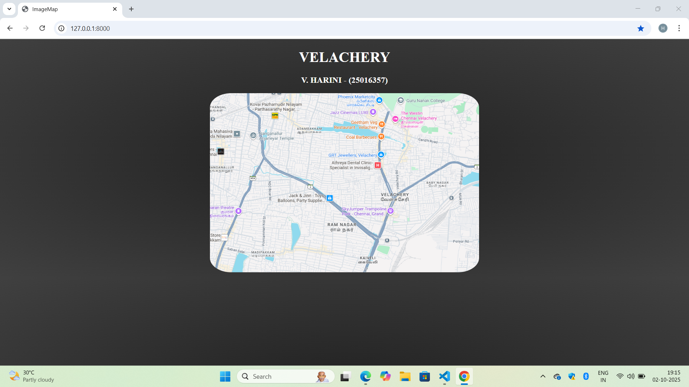
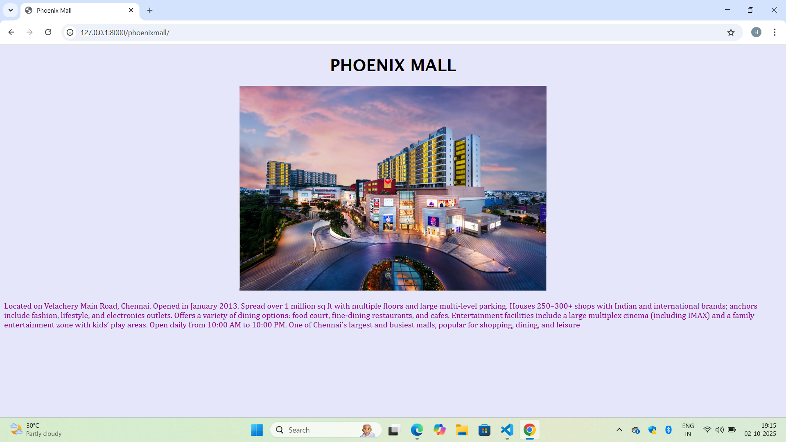
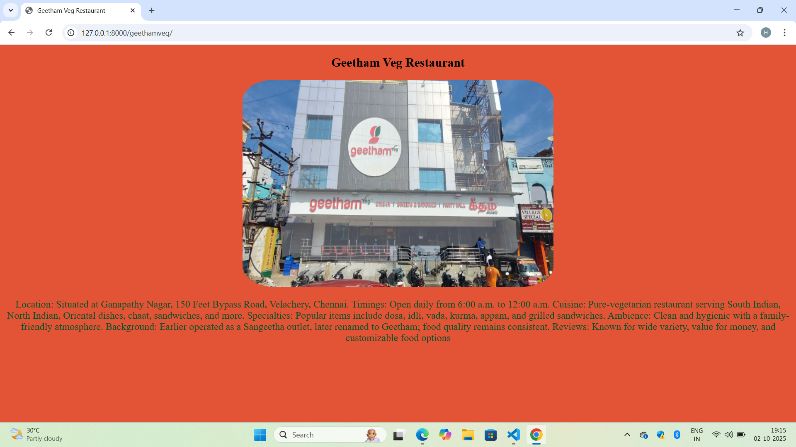
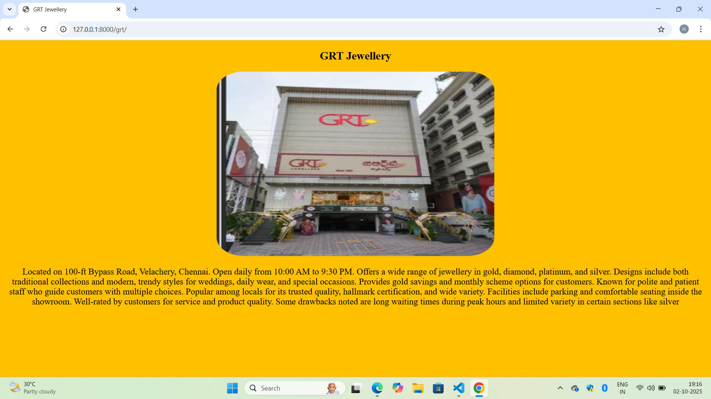
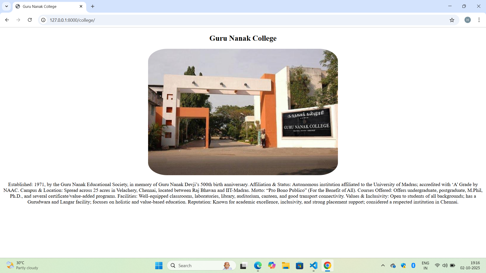
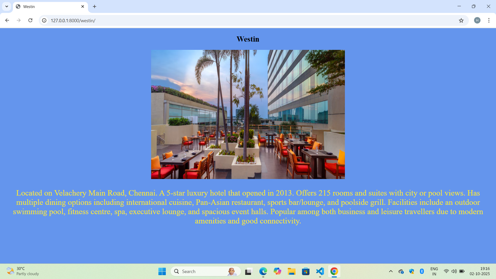

# Ex04 Places Around Me
# Date:2/10/25
# AIM
To develop a website to display details about the places around my house.

# DESIGN STEPS
## STEP 1
Create a Django admin interface.

## STEP 2
Download your city map from Google.

## STEP 3
Using <map> tag name the map.

## STEP 4
Create clickable regions in the image using <area> tag.

## STEP 5
Write HTML programs for all the regions identified.

## STEP 6
Execute the programs and publish them.

# CODE

```
map.html

<!DOCTYPE html>
<html lang="en">
<head>
    <meta charset="UTF-8">
    <meta name="viewport" content="width=device-width, initial-scale=1.0">
    <title>ImageMap</title>
    <style>
        body{
            background: radial-gradient(#202020,#282828,#303030,#383838,#404040);
        }
        h1{
            color: white;
        }
        h3{
            color: white;
        }
        img{
            border-radius: 8%;
        }
    </style>
</head>
<body>
    <center>
        <h1>VELACHERY</h1>
        <h3>V. HARINI - (25016357)</h3>
        
        
        <map name="map">
        <area shape="rect" coords="100,6,400,40" href="" title="Phoenix Mall" alt="Phoenix Mall">
        <area shape="rect" coords="160,60,350,100" href="" title="Geetham Veg Restaurant" alt="Geetham Veg Restaurant">
        <area shape="rect" coords="160,100,450,150" href="" title="GRT Jewellery" alt="GRT Jewellery">
        <area shape="rect" coords="120,6,520,40" href="" title="Guru Nanak College" alt="Guru Nanak College">
        <area shape="rect" coords="120,15,520,60" href="" title="Westin" alt="Westin">
        </map>
    </center>
</body>
</html>

phoenixmall.html


<!DOCTYPE html>
<html lang="en">
<head>
    <meta charset="UTF-8">
    <meta name="viewport" content="width=device-width, initial-scale=1.0">
    <title>Phoenix Mall</title>
    <style>
        p{
            font-family: Cambria, Cochin, Georgia, Times, 'Times New Roman', serif;
            color: darkmagenta;
        }

        h1{
            font-family: 'Lucida Sans', 'Lucida Sans Regular', 'Lucida Grande', 'Lucida Sans Unicode', Geneva, Verdana, sans-serif;
            
        }

    </style>
</head>
<body bgcolor="lavender">
    <center>
        <h1>PHOENIX MALL</h1>
        
        <br>
    </center>
    <p>Located on Velachery Main Road, Chennai.

Opened in January 2013.

Spread over 1 million sq ft with multiple floors and large multi-level parking.

Houses 250–300+ shops with Indian and international brands; anchors include fashion, lifestyle, and electronics outlets.

Offers a variety of dining options: food court, fine-dining restaurants, and cafes.

Entertainment facilities include a large multiplex cinema (including IMAX) and a family entertainment zone with kids’ play areas.

Open daily from 10:00 AM to 10:00 PM.

One of Chennai’s largest and busiest malls, popular for shopping, dining, and leisure</p>
    
</body>
</html>

geetham-veg.html


<!DOCTYPE html>
<html lang="en">
<head>
    <meta charset="UTF-8">
    <meta name="viewport" content="width=device-width, initial-scale=1.0">
    <title>Geetham Veg Restaurant</title>
    <style>
        img{
            border-radius: 10%;
        }
        p{
            color: #05522a;
            font-size: larger;
        }
        
    </style>
</head>
<body bgcolor="#E35335">
    <center>
    <h2>Geetham Veg Restaurant</h2>
    
    <p>Location: Situated at Ganapathy Nagar, 150 Feet Bypass Road, Velachery, Chennai.

Timings: Open daily from 6:00 a.m. to 12:00 a.m.

Cuisine: Pure-vegetarian restaurant serving South Indian, North Indian, Oriental dishes, chaat, sandwiches, and more.

Specialties: Popular items include dosa, idli, vada, kurma, appam, and grilled sandwiches.

Ambience: Clean and hygienic with a family-friendly atmosphere.

Background: Earlier operated as a Sangeetha outlet, later renamed to Geetham; food quality remains consistent.

Reviews: Known for wide variety, value for money, and customizable food options</p>
    </center>
</body>
</html>

grt.html


<!DOCTYPE html>
<html lang="en">
<head>
    <meta charset="UTF-8">
    <meta name="viewport" content="width=device-width, initial-scale=1.0">
    <title>GRT Jewellery</title>
    <style>
        img{
            border-radius: 10%;
        }

        p{
            font-size: larger;
        }
    </style>
</head>
<body bgcolor="#FFC000">
    <center>
    <h2>GRT Jewellery</h2>
    
    <p>Located on 100-ft Bypass Road, Velachery, Chennai.

Open daily from 10:00 AM to 9:30 PM.

Offers a wide range of jewellery in gold, diamond, platinum, and silver.

Designs include both traditional collections and modern, trendy styles for weddings, daily wear, and special occasions.

Provides gold savings and monthly scheme options for customers.

Known for polite and patient staff who guide customers with multiple choices.

Popular among locals for its trusted quality, hallmark certification, and wide variety.

Facilities include parking and comfortable seating inside the showroom.

Well-rated by customers for service and product quality.

Some drawbacks noted are long waiting times during peak hours and limited variety in certain sections like silver</p>
    </center>
</body>
</html>

gurunanak.html


<!DOCTYPE html>
<html lang="en">
<head>
    <meta charset="UTF-8">
    <meta name="viewport" content="width=device-width, initial-scale=1.0">
    <title>Guru Nanak College</title>
    <style>
        body{
            background-color: #ffffff;
        }
        img{
            border-radius: 10%;
            font-size: larger;
        }
    </style>
</head>
<body>
    <center>
    <h2>Guru Nanak College</h2>
    
    <p>Established: 1971, by the Guru Nanak Educational Society, in memory of Guru Nanak Devji’s 500th birth anniversary.

Affiliation & Status: Autonomous institution affiliated to the University of Madras; accredited with ‘A’ Grade by NAAC.

Campus & Location: Spread across 25 acres in Velachery, Chennai, located between Raj Bhavan and IIT-Madras.

Motto: “Pro Bono Publico” (For the Benefit of All).

Courses Offered: Offers undergraduate, postgraduate, M.Phil, Ph.D., and several certificate/value-added programs.

Facilities: Well-equipped classrooms, laboratories, library, auditorium, canteen, and good transport connectivity.

Values & Inclusivity: Open to students of all backgrounds; has a Gurudwara and Langar facility; focuses on holistic and value-based education.

Reputation: Known for academic excellence, inclusivity, and strong placement support; considered a respected institution in Chennai.</p>
    </center>
</body>
</html>

westin.html


<!DOCTYPE html>
<html lang="en">
<head>
    <meta charset="UTF-8">
    <meta name="viewport" content="width=device-width, initial-scale=1.0">
    <title>Westin</title>
    <style>
        p{
            color: #f8e622;
            font-size: 25px;
        }
    </style>
</head>
<body bgcolor="#6495ED">
    <center>
    <h2>Westin</h2>
    
    <p>Located on Velachery Main Road, Chennai.

A 5-star luxury hotel that opened in 2013.

Offers 215 rooms and suites with city or pool views.

Has multiple dining options including international cuisine, Pan-Asian restaurant, sports bar/lounge, and poolside grill.

Facilities include an outdoor swimming pool, fitness centre, spa, executive lounge, and spacious event halls.

Popular among both business and leisure travellers due to modern amenities and good connectivity.</p>
    </center>
    
</body>
</html>

```


# OUTPUT







# RESULT
The program for implementing image maps using HTML is executed successfully.
